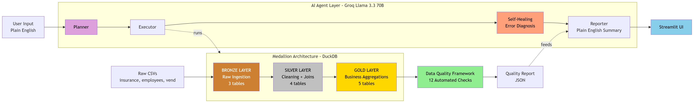

# 🤖 AI ETL Orchestrator Agent

A locally-running AI agent that takes plain English instructions and automatically plans, executes, and validates an end-to-end ETL pipeline — built on the Medallion Architecture with AI-powered orchestration, data quality checks, and error diagnosis.

---

## 🎯 What It Does

Type a natural language instruction → the agent plans the steps, runs them against a DuckDB warehouse, runs 12 automated quality checks, and writes a plain English summary of what happened.

You type:  "Run the whole pipeline and verify data quality"
↓
AI plans:  [bronze, silver, gold, quality]
↓
AI runs:   Bronze → Silver → Gold → Quality Checks
↓
AI reports: "Pipeline completed. 11/12 checks passed. 1 warning..."

---

> 📺 **[Watch the Demo Video](https://www.loom.com/share/6782c8489c7b418f8029e826f4b905cb)**

## 🏗️ Architecture



Raw CSVs  →  BRONZE (raw)  →  SILVER (cleaned & joined)  →  GOLD (business aggregates)
↓                    ↓                            ↓
Quality checks on every layer • AI-powered orchestration • Self-healing

### Bronze → Silver → Gold (Medallion Architecture)

| Layer | Purpose | Tables |
|---|---|---|
| 🥉 **Bronze** | Raw, unchanged ingestion | 3 tables |
| 🥈 **Silver** | Cleaning, type casting, joins | 4 tables |
| 🥇 **Gold** | Business aggregations | 5 tables |

---

## 🛠️ Tech Stack

| Layer | Tool |
|---|---|
| **AI Brain** | Groq API (Llama 3.3 70B) |
| **Agent Framework** | LangChain |
| **Warehouse** | DuckDB |
| **Data Processing** | Pandas |
| **UI** | Streamlit |
| **Quality Framework** | Custom SQL-based checks |

---

## ✨ Features

- **🧠 Natural Language Orchestration** — Describe what you want in plain English
- **🏗️ Medallion Architecture** — Industry-standard Bronze/Silver/Gold pattern
- **✅ Automated Data Quality** — 12 built-in checks across all layers
- **🩹 AI-Powered Error Diagnosis** — LLM reads stack traces and classifies failures
- **📊 Live UI Dashboard** — Streamlit interface with quality metrics
- **📝 Human-Readable Reports** — AI writes plain English run summaries
- **💼 Real Production Pattern** — Same architecture used at Databricks and banks

---

## 📦 Dataset

Real insurance claims data from Kaggle ([source](https://www.kaggle.com/datasets/mastmustu/insurance-claims-fraud-data)):

| File | Rows | Columns |
|---|---|---|
| `insurance_data.csv` | 10,000 | 38 |
| `employee_data.csv` | 1,200 | 10 |
| `vendor_data.csv` | 600 | 7 |

---

## 🚀 Quick Start

### 1. Clone the repo
```bash
git clone https://github.com/Pari4113/ai-etl-orchestrator-agent.git
cd ai-etl-orchestrator-agent
```

### 2. Set up environment
```bash
python -m venv venv
venv\Scripts\activate   # Windows
source venv/bin/activate  # Mac/Linux

pip install -r requirements.txt
```

### 3. Get a free Groq API key
- Sign up at [console.groq.com](https://console.groq.com) (free, no credit card)
- Create an API key
- Create a `.env` file in the project root:
GROQ_API_KEY=gsk_your_key_here

### 4. Download the dataset
Download the 3 CSV files from Kaggle into `data/`.

### 5. Run the agent (CLI)
```bash
python -m agents.orchestrator
```

### 6. Or launch the Streamlit UI
```bash
streamlit run app.py
```

---

## 📂 Project Structure

etl-agent/
├── data/                       # Raw source CSVs
├── warehouse/                  # DuckDB warehouse file
├── agents/
│   ├── extractor.py           # CSV extraction
│   ├── bronze_loader.py       # Raw ingestion
│   ├── silver_cleaner.py      # Cleaning + joins
│   ├── gold_builder.py        # Business aggregations
│   ├── quality_checker.py     # 12 automated data quality checks
│   ├── healer.py              # AI-powered error diagnosis
│   └── orchestrator.py        # Natural language → plan → execute → summarize
├── notebooks/
│   └── 01_data_exploration.ipynb
├── app.py                     # Streamlit UI
├── config.py                  # Central configuration
└── requirements.txt

---

## 🔍 Data Quality Framework

Automated checks run at every layer:

| Check Type | Example |
|---|---|
| **Completeness** | No nulls in critical columns |
| **Uniqueness** | Primary keys are unique |
| **Validity** | Age 18–100, positive claim amounts |
| **Referential Integrity** | All AGENT_IDs exist in employee table |
| **Consistency** | Gold totals match Silver totals |
| **Date Logic** | Loss date ≤ Report date |

---

## 🎬 Demo Scenarios

| User Input | Agent Behavior |
|---|---|
| *"Run the whole pipeline"* | Runs Bronze → Silver → Gold → Quality |
| *"Just load the raw data"* | Runs Bronze only |
| *"Check data quality"* | Runs Quality checks only |
| *"Rebuild the gold layer"* | Runs Gold only |

---

## 🗺️ Roadmap

- [x] Medallion Architecture (Bronze/Silver/Gold)
- [x] AI-powered orchestration
- [x] Data Quality Framework
- [x] Self-healing error diagnosis
- [x] Streamlit UI
- [ ] Full schema drift auto-recovery
- [ ] Multi-dataset support
- [ ] Scheduled runs
- [ ] Historical run tracking

---

## 👤 Author

**Paridhi** — Aspiring Data Engineer  

📧 [Email](mailto:patelparidhi33@gmail.com)
